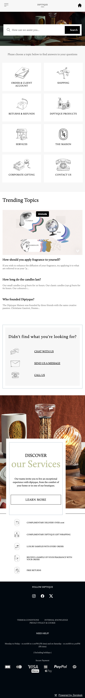
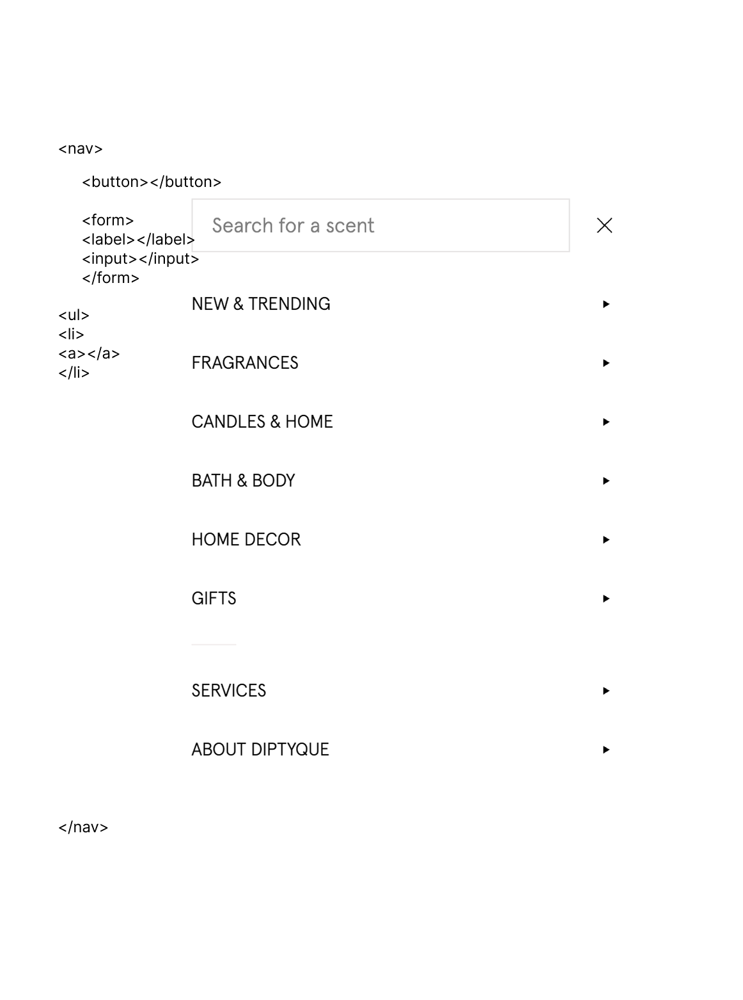
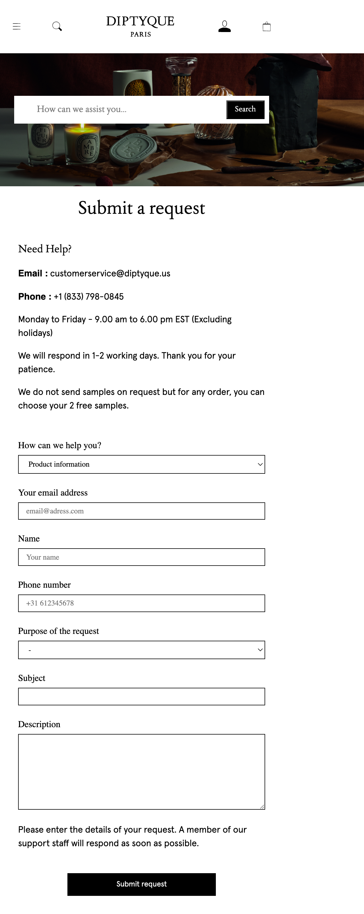
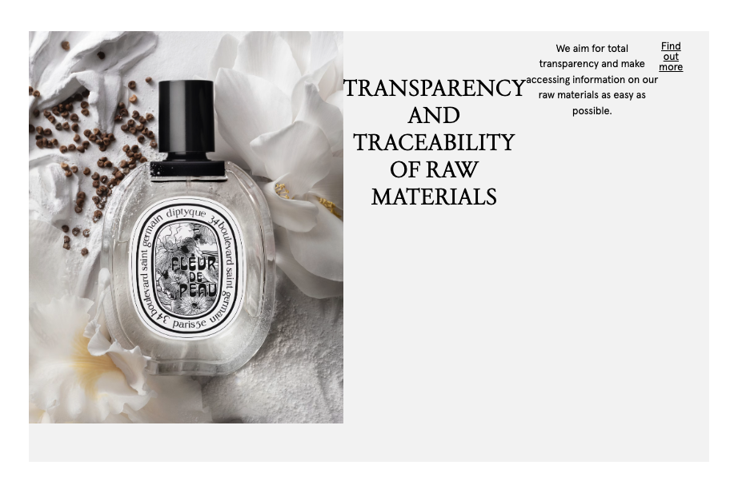

# Procesverslag
Markdown is een simpele manier om HTML te schrijven.  
Markdown cheat cheet: [Hulp bij het schrijven van Markdown](https://github.com/adam-p/markdown-here/wiki/Markdown-Cheatsheet).

Nb. De standaardstructuur en de spartaanse opmaak van de README.md zijn helemaal prima. Het gaat om de inhoud van je procesverslag. Besteedt de tijd voor pracht en praal aan je website.

Nb. Door *open* toe te voegen aan een *details* element kun je deze standaard open zetten. Fijn om dat steeds voor de relevante stuk(ken) te doen.

## Jij

  
uitwerken voor kick-off werkgroep

  ### Auteur:
  Insa Witterland

  #### Je startniveau:
  Blauw

  #### Je focus:
  Responsive
 

## Je website

  
uitwerken voor kick-off werkgroep

  ### Je opdracht:
  https://www.diptyqueparis.com/en_eu/?cc=NL De twee pagina's van de website van het parfummerk Diptique ga ik nabouwen. Deze website is erg minimalistisch en strak.
  #### Screenshot(s) van de eerste pagina (small screen): 
  Homepagina
  

  #### Screenshot(s) van de tweede pagina (small screen):
  Customer service Europe
  
 

## Toegankelijkheidstest 1/2 (week 1)

  
uitwerken na test in 2e werkgroep

  ### Bevindingen
De website van Diptyque is erg makkelijk te navigeren met een screenreader. De layout is minimalistisch en heeft een goede flow. Elk element wordt kort en duidelijk benoemd. Er zijn wel wat afbeeldingen die "Image empty" aangeven. Hier zou nog verbetering in kunnen komen. Verder is het contrast goed, want er zijn veel zwarte letters op een witte achtergrond. Een minimalistisch maar strak ontwerp dat werkt. Aangezien het een luxe parfummerk is, is het goed dat het erg inclusief is. Dit staat erg professioneel. Het was een erg interessante ervaring en ik was positief verrast. Verder zijn er weinig opmerkingen. 

## Breakdownschets (week 1)

  
uitwerken na afloop 3e werkgroep

  ### de hele pagina: 
  

  ### dynamisch deel (bijv menu): 
  

## Voortgang 1 (week 2)

  
uitwerken voor 1e voortgang

  ### Stand van zaken
  hier dit ging goed & dit was lastig (neem ook screenshots op van delen van je website en code)

  De grid en flexbox oefeningen gingen best oke. Beter dan gedacht. Verder vond ik het erg fijn dat we eerst code gingen leren en vervolgens pas gingen coderen. Toen ik eenmaal toekam aan de html, ging het redelijk vlot. Wat minder ging was mijn planning de afgelopen paar dagen. Ik hoop snel verder te kunnen met mijn html. Het verschil tussen article en section snap ik nog steeds niet.

  ### Agenda voor meeting
  samen met je groepje opstellen

  Zelf heb ik mijn breakdown schets laten zien en feedback gekregen op de html. Hierdoor kan ik goed aan de slag
  met het begin van mijn eerste pagina.

  ### Verslag van meeting
  Veel ging al goed. De HTML begrijp ik eindelijk. Ik mocht een aantal dingen weglaten om het makkelijker te maken.

## Voortgang 2 (week 3)

  
uitwerken voor 2e voortgang

  ### Stand van zaken
  Hier dit ging goed & dit was lastig (neem ook screenshots op van delen van je website en code)

  Het beginnetje van de HTML ging redelijk vlot, aangezien ik dit vorige week heb laten zien tijdens het gesprek.
  Ik had graag meer aan de CSS willen doen, alleen ging dit door mijn verhuizing niet kwa tijd. Ik hoop vanavond nog een inhaal slag te kunnen maken.

  ### Agenda voor meeting
  samen met je groepje opstellen

  Ons groepje houdt niet echt contact, dus we bespreken het tijdens het gesprek.

  ### Verslag van meeting
  hier na afloop snel de uitkomsten van de meeting vastleggen.

  Ik was nog niet aan pagina 2 begonnen, maar ben nu geswitched van FAQ naar Contact. De contact pagina heeft een form en dat is verplicht. Verder had ik nog wat format tips gekregen. De rest van mijn HTML was prima.

  Mijn hoofdpagina:
  
  
  De nieuwe tweede pagina:
  

## Toegankelijkheidstest 2/2 (week 4)

  
uitwerken na test in 9e werkgroep

  ### Bevindingen
  Lijst met je bevindingen die in de test naar voren kwamen (geef ook aan wat er verbeterd is):
  Mijn website scorde redelijk goed op gebied van toegankelijkheid. Fatima had het getest. Mijn website heeft een betere heading structuur, alt tekst en navigatie dan de originele website. Ik zou nog een aantal buttons kunnen verstoppen of een aantal teksten kunnen uitbreiden.. Dit gaat over pagina 1, aangezien ik pagina 2 nog niet heb.

## Voortgang 3 (week 4)

  
uitwerken voor 3e voortgang

  ### Stand van zaken
  hier dit ging goed & dit was lastig (neem ook screenshots op van delen van je website en code)
  
  

  ### Agenda voor meeting
  samen met je groepje opstellen
  
   Websites bespreken en laten zien waar we moeite mee hadden.

  ### Verslag van meeting
  hier na afloop snel de uitkomsten van de meeting vastleggen
  
  We hebben ons werk laten zien. De ene student had veelste veel divjes, de ander problemen met muziek afspelen op javascript en de ander liep vast bij een hamburger menu. Samen hebben we kunnen kijken naar de code en kunnen bespreken wat goede oplossingen zijn. Programmeren verloopt bij mij best goed. Ik loop niet lang vast bij problemen en kom er redelijk snel uit. Nu moet ik beginnen aan mijn tweede pagina en focus states toe gaan voegen.

  Ik heb leren nesten van css class zodat ik niet telkens .home hoef te typen. Had gehoopt dit eerder te weten.

  Later had ik mijn code door de W3C validator gedaan en kwam erachter dat mijn mappen structuur niet goed is. Dit moet ik nu handmatig aan gaan passen.

## Eindgesprek (week 5)

  
uitwerken voor eindgesprek

  ### Je uitkomst - karakteristiek screenshots:
  
  
  (De screenshots zijn niet helemaal goed, beetje versprongen)

  ### Dit ging goed/Heb ik geleerd: 
 Ik heb enorm veel geleerd. Van css selectors tot aan een website responsive maken. 
 Voorheen moest ik letterlijk alles opzoeken, maar het gaat steeds vlotter allemaal.

  ### Dit was lastig/Is niet gelukt:

  
  
  
  Doordat bij pagina twee de H1 veranderde versprong het logo helemaal in de header en daardoor klopte niks meer.. met veel moeite heb ik het kunnen oplossen.

  
  
  Om de HTML voor de screenreader goed te houden heb ik de H2 boven de img gezet, alleen nu ik het achteraf responsive ging maken kwam ik een parent element tekort voor de tekst.
  Dit heb ik met @media (min-width) flex row proberen op te lossen, maar kom niet verder dan dit. Daarom heb ik na veel moeite toch maar een div toegevoegd...

  Op pagina 2 had ik een ul in de form gebruikt. Dit mag blijkbaar niet, dus heb ik het aangepast naar divjes. Ik had al CSS styling, dus dit kostte echt weer wat tijd.

  Een ding waar ik veel tijd aan kwijt was en niet lukte was de fixed/ sticky header. Om items aan je shopping bag toe te kunnen voegen moet je natuurlijk de header kunnen zien, dus ik vond het jammer dat dat niet gelukt was. 

  Het laatste wat mij niet lukte was op het einde een img laten veranderen door een hover. Dan moest ik weer tags gaan toevoegen en dan versprong mijn CSS weer. Hier had ik geen tijd voor om het goed uit te zoeken.

  Als ik meer tijd had zou ik...
  - De "Best sellers" een hover img geven zodat je de achterkant van de fles kunt zien.
  - Een animatietje toevoegen
  - Betere aantoningen contact formulier
  - Header sticky maken...
  - Alles net iets beter maken

## Bronnenlijst

  
continu bijhouden terwijl je werkt

  1. bron 1 CSS Tricks - CSS Grid Layout Guide
  2. bron 2 CSS Tricks - CSS Flexbox Layout Guide
  3. bron 3 ChatGpT - voor uitleg van element of om stukken te controleren als ik vastliep
  4. Bron 4 CodePen van Sanne - Oefening 2 - responsive  2-buttons hamburger
  5. Bron 5 W3Schools - CSS Styling Forms
  6. Bron 6 Kevin Powell - Form Styling Essentials | The basics to modern CSS tips & tricks (YouTube)
  7. Bron 7 CodePen van Sanne - JS 3-stap - Oefening 3 - uitwerking shopping cart

